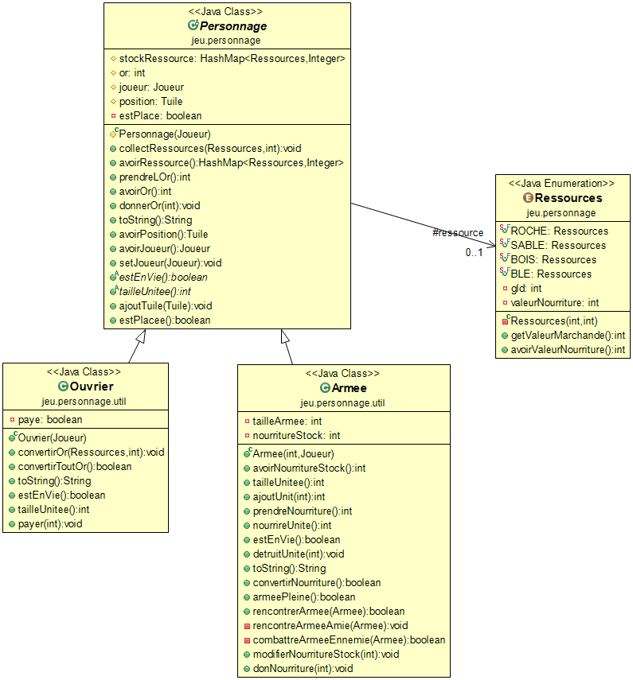
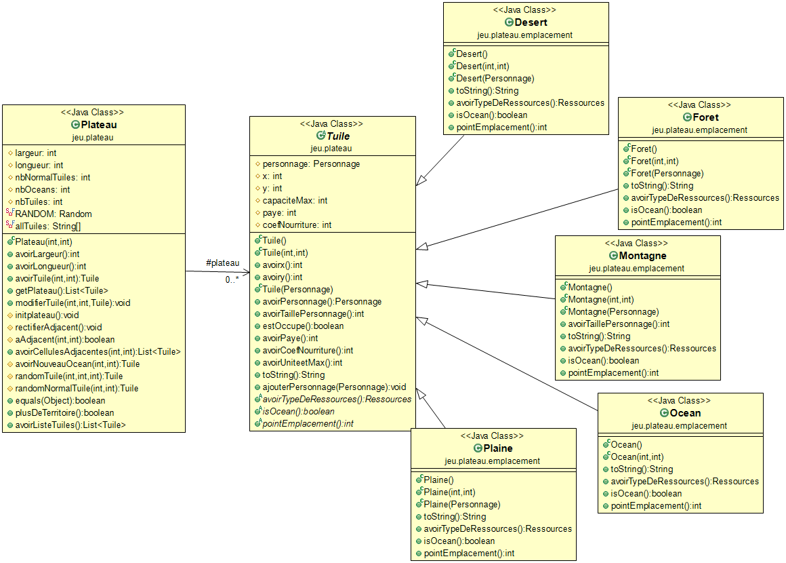
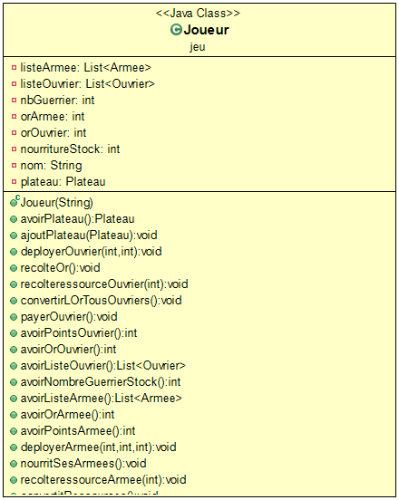
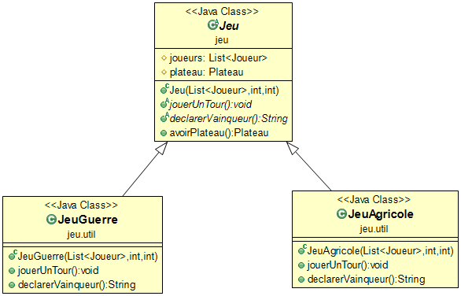

# l2s4-projet-2021

Vous devez *forker* ce projet dans votre espace de travail Gitlab (bouton `Fork`) et vidéo sur le [portail](https://www.fil.univ-lille1.fr/portail/index.php?dipl=L&sem=S4&ue=Projet&label=Documents)

# Equipe

- Lounès Me***
- Yanis A***
- Matthieu M***
- Ismail Chafi

# Sujet

[Le sujet 2021](https://www.fil.univ-lille1.fr/portail/index.php?dipl=L&sem=S4&ue=Projet&label=Documents)

# Livrables

## Livrable 1

### Atteinte des objectifs
Le livrable 1 s'est bien passé dans l'ensemble avec un bon code de nos idées.
Nos personnages ont été codés grâce à trois classes : Personnage (classe mère), Ouvrier (classe qui modélise les ouvriers) ainsi qu'une classe Armee (pour modéliser les armées).

<u>Livrable1</u>:

La classe qui nous permet de gérer les ressources a été faite avec une classe enum pour faciliter.

### Difficultés restant à résoudre

## Livrable 2

### Atteinte des objectifs
Le plateau a été implémenté en répondant correctement aux différentes attentes.

<u>Livrable2</u>:

Pour le plateau, nous avons décidé d'utiliser une classe mère Tuile qui regroupe les différentes méthodes associées aux différents types de tuile.
Les différents types de tuile ont des méthodes communes (estOccupe(), etc), mais ont également des méthodes différentes (TypeDeRessources, etc).

### Difficultés restant à résoudre

## Livrable 3

### Atteinte des objectifs
Toutes nos modélisations par rapport aux actions ont été faites dans la classe joueur afin d'avoir une manipulation plus simple des actions dans la classe principale qui fait tourner le jeu. Toutes ces méthodes qui nous permettent de faire les actions utilisent les différentes méthodes faites dans tout le projet.
Les actions complètes ont pu être complètement modélisées après avoir ajouté de nouvelles méthodes dans les classes Armee/Ouvrier/Plateau/Tuile

<u>Livrable3</u>:

### Difficultés restant à résoudre

## Livrable 4

### Atteinte des objectifs
Le jeu peut être lancé grâce à la classe JeuMain qui permet un suivi de ce qui se passe pendant un tour de jeu. À l'aide du type Scanner, et de quelques print, un meilleur suivi du déroulement de la partie a pu être possible.
Ces modélisations sont possibles grâce à la classe mère Jeu et les deux classes JeuAgricole et JeuGuerre (qui permettent respectivement de lancer une partie de jeu Agricole et Guerre/Conquête). 
La mise en place de ces classes est fondée sur la construction d'une partie avec deux joueurs (une amélioration du code visant à augmenter ce nombre est possible grâce à l'existence d'une liste contenant les joueurs participant et effectuant des tours de jeu) et un plateau sur lequel ils jouent. 
Elle s'appuie aussi sur la modélisation des actions possibles à effectuer au cours d'une manche, modélisation qui vaut pour tous les joueurs, à travers la méthode jouerUnTour(). Et une méthode declarerVainqueur() retourne le joueur gagnant à l'aide d'un print.
Enfin, un examen attentif du cours d'une partie selon le sujet a permis de réduire au mieux les lignes de codes, afin de le rendre plus lisible et moins lourd.

<u>Livrable4</u>:

### Difficultés restant à résoudre

# Journal de bord

## Semaine 1
   La première semaine nous a servi à nous mettre d'accord sur notre vision des jeux afin que ce soit plus simple pour nous de faire un premier diagramme UML de nos idées. 
Nous avions donc commencé par étudier les deux jeux séparement pour mieux voir les points communs entre les deux jeux. Pour cette première partie du projet, il fallait commencer par modéliser les personnages des deux jeux.
L'idée qui en est sortie est un diagramme avec trois classes, une classe Ouvrier pour le jeu qui utilise des ouvriers, une classe Armee pour le jeu de conquête de territoires et une classe abstraite, Personnage, qui nous sert à factoriser le code commun aux deux premières classes.

## Semaine 2
   Cette deuxième semaine a été la semaine où nous avions commencé à envoyer un premier diagramme UML de nos personnages afin d'avoir une validation de nos idées.
Nous avons dû nous y prendre à deux fois à cause d'erreurs. 
	- Première fois: syntaxe, langue utilisée, nom des classes, méthode pas bien définie.
	- Deuxième fois: syntaxe principalement.
Suite à ça, nous avons entamé la phase d'écriture du code des classes.

## Semaine 3
   Cette semaine a permis de finir de mettre à jour la plupart des méthodes des classes liées aux personnages, il y a également eu une mise à jour concernant la création des tuiles (ce sont maintenant des class et non plus un enum) qui font partie du package Emplacement, mise à jour de la classe Ouvrier qui ne peut plus être mise sur des cases qui n'acceptent personne(ex: Ocean)(grâce à la méthode tailleUnite) et mise à jour des classes ArmeeTest et OuvrierTest. La méthode Combat qui fait s'affronter deux armées a également été faite.

## Semaine 4
Interruption pédagogique: Cette semaine nous a permis de nous répartir les tâches concernant la création du plateau ainsi que de voir les différents problèmes à régler.

## Semaine 5
   Cette semaine nous a permis de créer le plateau, faire les tests de nos Tuiles, ajouter des méthodes dans les classes Armee et Ouvrier (ainsi que leurs tests associés dans les classes ArmeeTest et OuvrierTest), ajouter une méthode addPersonnange dans la classe Tuile qui nous permet d'ajouter un personnage sur une tuile en prenant en compte: si la tuile est occupée, si le personnage sur la tuile est en vie, ce qui nous a permis de pouvoir mettre une armée sur une tuile où se trouve une armée de taille 0 (considérée comme morte).

## Semaine 6
Semaine qui a servi à finir le livrable 2 avec la modélisation du plateau.
Semaine qui nous a également permis de rectifier certains oublis dans les classes Armee et Ouvrier (avec l'ajout de méthodes comme getPaye(), convertirOr(), paye() qui nous permet de donner la paye à l'ouvrier en fonction de sa tuile.

## Semaine 7
Durant cette semaine, nous avons principalement discuté des fonctionnalités nécessaires pour la modélisation des actions. C'est-à-dire savoir quelles seront les méthodes liées à la classe Joueur, création de nouvelles classes telles que Game() qui nous permettra de faire une modélisation générale des différentes parties de jeu possible (jeu avec l'armée ou jeu avec des ouvriers).

## Semaine 8
Interruption pédagogique 

## Semaine 9
La semaine 8/9 a permis de faire la classe Joueur (ainsi que ses tests) afin de pouvoir créer des joueurs pour jouer aux jeux Agricole et Conquête de territoires. Ajout de la méthode isOcean afin de pouvoir savoir plus facilement si une Tuile est du type Ocean ou non.
Toutes les actions (Livrable 3) ont été implémentées dans la classe Joueur.

Rectification de la classe Plateau afin de corriger les derniers bugs associés aux tuiles adjacentes.
Création de la classe Jeu qui est la classe mère des classes JeuAgricole et JeuGuerre qui implémentent les méthodes jouerUnTour afin de pouvoir lancer une partie de jeu dans un main.

## Semaine 10
Mise à jour du plateau pour utiliser la nouvelle méthode isOcean afin d'avoir un plateau qui soit adapté à l'ajout d'une nouvelle tuile.
Ajout d'une méthode afin de savoir si un plateau est plein, qui nous servira à arrété une partie de jeu qui n'a plus aucune tuile disponible.
Début de la classe JeuMain qui permettra de lancer une partie de jeu.

## Semaine 11
La classe JeuMain a été terminée.
Brainstorming des idées de chacun sur la façon de présenter notre projet le jour de la soutenance (diaporama), ainsi que le début de l'organisation de nos fichiers afin de pouvoir faire le Makefile plus facilement.
Nous avons également séparé la classe JeuMain en deux classes, AgricoleMain et GuerreMain afin de pouvoir produire le fichier .jar associé à chacun.
Nous avons également ajouté  plusieurs print dans notre code afin d'avoir un meilleur suivi d'une partie de jeu.

## Semaine 12
Le Makefile a été terminé. Il produit donc un fichier .jar associé à chaque jeu.
Le diaporama est toujours en cours de réalisation afin de présenter au mieux le développement de projet via les différentes consignes.
Les tâches pour la présentation ont également été réparties.
Les dernières choses à faire concernant le projet sont également en cours, comme par exemple:
-Mode d'emploi des main
-Présentation du projet

COMMENT COMPILER LE PROJET:
Pour cela, il faut:
1)Compiler les classes avec la commande make classes.
->Se placer à la racine:
make classes

->Un dossier classes sera ajouté avec toutes les classes du projet compiliées.

2)Compiler les main des 2 jeux.
->Se placer à la racine
make guerre
make agricole

Les deux fichiers .class seront ajoutés dans le dossier ./classes

3)Creation des .jar.
->se placer à la racine
make guerreJar
make agricoleJar

->Deux .jar seront produits:
1)guerre.jar
pour lancer une partie du jeu de guerre.
2)agricole.jar 
pour lancer une partie du jeu de guerre.

UTILISATION:
Pour lancer une partie du jeu de guerre, faire par exemple:
java -jar jar/guerre.jar Raymond Odette

Pour lancer une partie du jeu de agricole, faire par exemple:
java -jar jar/agricole.jar Vigneron Eleveur Maraicher

ARBRE DU PROJET:
.
.
├── Makefile
├── README.md
├── classes
├── images
│   ├── Livrable1.png
│   ├── Livrable2.png
│   ├── Livrable3.png
│   ├── Livrable4.png
│   └── ModelisationComplete.png
├── jar
├── manifest-agricole
├── manifest-guerre
├── src
│   └── jeu
│       ├── AgricoleMain.java
│       ├── DrawException.java
│       ├── GuerreMain.java
│       ├── Jeu.java
│       ├── JeuMain.java
│       ├── Joueur.java
│       ├── personnage
│       │   ├── Personnage.java
│       │   ├── Ressources.java
│       │   └── util
│       │       ├── Armee.java
│       │       └── Ouvrier.java
│       ├── plateau
│       │   ├── Plateau.java
│       │   ├── PlateauMain.java
│       │   ├── Tuile.java
│       │   └── emplacement
│       │       ├── Desert.java
│       │       ├── Foret.java
│       │       ├── Montagne.java
│       │       ├── Ocean.java
│       │       └── Plaine.java
│       └── util
│           ├── JeuAgricole.java
│           └── JeuGuerre.java
├── test
│   └── jeu
│       ├── personnage
│       │   └── util
│       │       ├── ArmeeTest.java
│       │       └── OuvrierTest.java
│       └── plateau
│           ├── JoueurTest.java
│           ├── PlateauTest.java
│           └── emplacement
│               └── EmplacementTest.java
└── test4poo.jar

DEROULEMENT:
------------
1)JEU GUERRE
------------

La partie va se lancer avec 2 joueurs (Raymond et Odette, mais il est possible d'en mettre plus).
Ce sera au premier joueur de jouer, pour cela il aura 2 choix:
Déployer une armée: Oui/Non

1er cas: NON
->On va demander le nombre de ressource à récolter:
Choisissez la quantité de ressources que vous récolterez.

->On va ensuite convertir les ressources et nourrir les armées du joueur.

->Puis on va afficher une récapitulatif du joueur:

#############Récapitulatif du joueur Raymond######################################
#Raymond n'a plus que 35 guerriers prêt à  la bataille et un stock de 10 nourritures en stock #
#Listes des tuiles possédées par le joueur:#
#############################################################################

2ème cas: Oui
->On va demander sur quel tuile veut-il déployer une unité (à condition d'avoir encore des guerriers disponibles)
Tuiles disponibles :
Tuile de coordonnées (0,6) qui est de type Plaine
Tuile de coordonnées (0,7) qui est de type Desert
Tuile de coordonnées (2,5) qui est de type Desert
Tuile de coordonnées (2,6) qui est de type Montagne
Tuile de coordonnées (3,8) qui est de type Desert
Tuile de coordonnées (3,9) qui est de type Desert
Tuile de coordonnées (4,9) qui est de type Montagne
Tuile de coordonnées (6,8) qui est de type Foret
Tuile de coordonnées (6,9) qui est de type Montagne
Tuile de coordonnées (7,4) qui est de type Plaine
Tuile de coordonnées (7,5) qui est de type Desert
Tuile de coordonnées (7,8) qui est de type Plaine
Tuile de coordonnées (8,0) qui est de type Montagne
Tuile de coordonnées (8,1) qui est de type Foret
Tuile de coordonnées (8,3) qui est de type Foret
Tuile de coordonnées (8,4) qui est de type Desert
Tuile de coordonnées (8,5) qui est de type Foret
Tuile de coordonnées (8,6) qui est de type Plaine
Tuile de coordonnées (8,7) qui est de type Plaine
Tuile de coordonnées (8,8) qui est de type Desert
Tuile de coordonnées (8,9) qui est de type Desert
Tuile de coordonnées (9,0) qui est de type Montagne
Tuile de coordonnées (9,1) qui est de type Desert
Tuile de coordonnées (9,2) qui est de type Foret
Tuile de coordonnées (9,3) qui est de type Foret
Tuile de coordonnées (9,4) qui est de type Foret
Tuile de coordonnées (9,5) qui est de type Desert
Tuile de coordonnées (9,6) qui est de type Plaine
Tuile de coordonnées (9,7) qui est de type Montagne
Tuile de coordonnées (9,8) qui est de type Foret
Tuile de coordonnées (9,9) qui est de type Montagne

/!\POUR CHOISIR LA TUILE ET LE NOMBRE DE GUERRIERS
1)ABSCISSE DE LA TUILE
2)ORDONNÉE DE LA TUILE
3)NOMBRE DE GUERRIERS
Odette a déployé 3 unités de son armée sur la tuile de coordonnées (0,6) qui est de type Plaine

->On va demander le nombre de ressource à récolter:
Choisissez la quantité de ressources que vous récolterez.
(exemple: 10)
(ce qui va nous faire récolter 10 blés)

->On va ensuite convertir les ressources et nourrir les armées du joueur.

->Puis on va afficher une récapitulatif du joueur:

#############Récapitulatif du joueur Odette######################################
#Odette n'a plus que 32 guerriers prêt à  la bataille et un stock de 57 nourritures en stock #
#Listes des tuiles possédés par le joueur:#
#-)On a une armée de taille 3 sur la tuile (0,6)#
#############################################################################

---------------
2)JEU AGRICOLE
---------------
La partie va se lancer avec 3 joueurs (Vigneron Eleveur Maraicher, mais il est possible d'en mettre plus).
Ce sera au premier joueur de jouer, pour cela il aura 3 choix:
Deployer/Echanger/Attendre

1er cas: Deployer

->On va demander sur quel tuile veut-il déployer une unité (à condition d'avoir encore des guerriers disponibles)
Tuiles disponibles :
Tuile de coordonnes (0,0) qui est de type Plaine
Tuile de coordonnes (0,1) qui est de type Foret
Tuile de coordonnes (0,6) qui est de type Plaine
Tuile de coordonnes (0,7) qui est de type Montagne
Tuile de coordonnes (1,7) qui est de type Montagne
Tuile de coordonnes (2,3) qui est de type Desert
Tuile de coordonnes (2,4) qui est de type Plaine
Tuile de coordonnes (2,6) qui est de type Plaine
Tuile de coordonnes (2,7) qui est de type Montagne
Tuile de coordonnes (3,5) qui est de type Foret
Tuile de coordonnes (3,6) qui est de type Desert
Tuile de coordonnes (3,7) qui est de type Montagne
Tuile de coordonnes (4,3) qui est de type Montagne
Tuile de coordonnes (4,4) qui est de type Montagne
Tuile de coordonnes (4,6) qui est de type Montagne
Tuile de coordonnes (5,1) qui est de type Plaine
Tuile de coordonnes (5,2) qui est de type Foret
Tuile de coordonnes (5,3) qui est de type Plaine
Tuile de coordonnes (5,4) qui est de type Montagne
Tuile de coordonnes (6,0) qui est de type Montagne
Tuile de coordonnes (6,1) qui est de type Montagne
Tuile de coordonnes (6,6) qui est de type Plaine
Tuile de coordonnes (6,7) qui est de type Montagne
Choisissez une tuile parmi celles proposes.
/!\POUR CHOISIR LA TUILE
1)ABSCISSE DE LA TUILE (ex: 6)
2)ORDONNÉE DE LA TUILE (ex: 7)

Vigneron a déployé un ouvrier sur la tuile de coordonnes (6,7) qui est de type Montagne

->On va demander le nombre de ressource à récolter:
Choisissez la quantité de ressources que vous rcolterez.
(ex: 2)
Notre ouvrier sur la tuile (6,7) va récolter 2 ressources
Vigneron a récolté 2 unités de ressources chez ses ouvriers.

->On va ensuite payer les ouvriers du joueur. (Ici, on va déponser 5or car on a un ouvrier sur une tuile Montagne)

->Puis on va afficher une récapitulatif du joueur:

#############Récapitulatif du joueur Vigneron######################################
#Vigneron a 10 Or en stock. #
#Listes des tuiles possdes par le joueur:#
#-)un ouvrier  sur la tuile (6,7) qui est de typeMontagne#
#############################################################################

2ème cas: Echanger
->On va échanger toutes les ressources des ouvriers du joueur en or et récuperer l'or
Eleveur a changé ses ressources contre de l'or.

->On va demander le nombre de ressource à récolter:
Choisissez la quantité de ressources que vous rcolterez.
(ex: 12)

->Puis payer tous les ouvriers et afficher un récapitulatif
#############Récapitulatif du joueur Eleveur######################################
#Eleveur a 15 Or en stock. #
#Listes des tuiles possédées par le joueur:#
#############################################################################

3ème cas: Attendre
->On ne va rien faire comme action au début

->Puis on va récolter

->Et enfin afficher le récapitulatif du joueur
#############Rcapitulatif du joueur Maraicher######################################
#Maraicher a 15 Or en stock. #
#Listes des tuiles possdes par le joueur:#
#############################################################################

